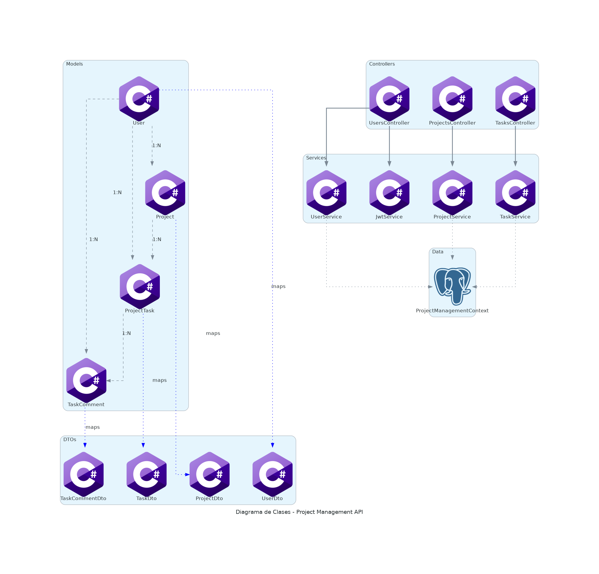
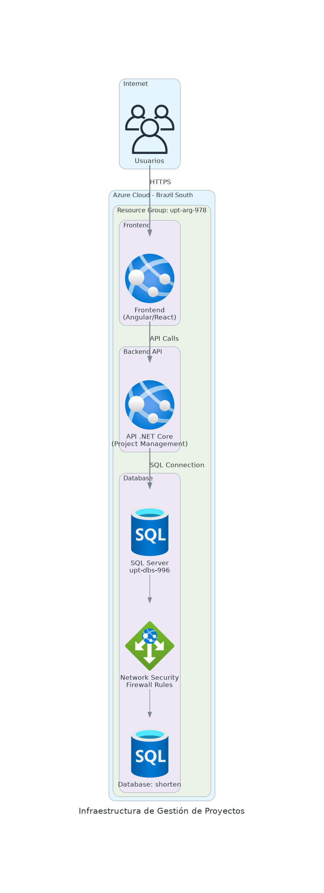

# 🎯 Project Management System

[](https://classroom.github.com/a/A-aUFMBb)
[](https://classroom.github.com/open-in-codespaces?assignment_repo_id=20616817)

## 📋 Descripción

Sistema completo de gestión de proyectos desarrollado con .NET 8.0, implementando una arquitectura limpia y desplegado en Azure. El sistema permite la gestión de usuarios, proyectos, tareas y comentarios con autenticación JWT.

## 🏗️ Arquitectura

```
📁 Project Structure
├── 🏗️ infra/                     # Infraestructura como código (Terraform)
│   └── main.tf                   # Configuración Azure SQL Server
├── 💻 backend/                   # API REST .NET 8.0
│   ├── Models/                   # Entidades del dominio
│   ├── Services/                 # Lógica de negocio
│   ├── Controllers/              # Controladores API
│   ├── DTOs/                     # Objetos de transferencia
│   └── Data/                     # Contexto Entity Framework
└── 🚀 .github/workflows/         # Automatización CI/CD
    ├── infra_diagram.yml         # Diagramas de infraestructura
    ├── class_diagram.yml         # Diagramas de clases
    ├── publish_doc.yml           # Publicación documentación
    ├── sonar.yml                 # Análisis de calidad
    ├── deploy_app.yml            # Despliegue aplicación
    ├── release.yml               # Creación de releases
    └── maintenance.yml           # Mantenimiento del proyecto
```

## 🛠️ Tecnologías

### Backend
- **.NET 8.0** - Framework principal
- **Entity Framework Core** - ORM para base de datos
- **JWT Bearer** - Autenticación y autorización
- **AutoMapper** - Mapeo de objetos
- **BCrypt** - Hashing de contraseñas
- **Swagger/OpenAPI** - Documentación de API

### Infraestructura
- **Azure SQL Server** - Base de datos en la nube
- **Terraform** - Infrastructure as Code
- **Azure Resource Group** - Agrupación de recursos

### DevOps & CI/CD
- **GitHub Actions** - Automatización de workflows
- **SonarQube** - Análisis de calidad de código
- **GitHub Pages** - Publicación de documentación
- **Docker** - Containerización (en releases)

## 🚀 Funcionalidades

### 👥 Gestión de Usuarios
- ✅ Registro de usuarios con validación
- ✅ Autenticación JWT
- ✅ Roles de usuario (Admin, Manager, Developer)
- ✅ Perfil de usuario completo

### 📁 Gestión de Proyectos
- ✅ CRUD completo de proyectos
- ✅ Estados de proyecto (Planning, InProgress, Completed, OnHold)
- ✅ Asignación de usuarios a proyectos
- ✅ Fechas de inicio y finalización

### 📋 Gestión de Tareas
- ✅ CRUD completo de tareas
- ✅ Prioridades (Low, Medium, High, Critical)
- ✅ Estados (Todo, InProgress, Done)
- ✅ Asignación de tareas a usuarios
- ✅ Vinculación con proyectos

### 💬 Sistema de Comentarios
- ✅ Comentarios en tareas
- ✅ Seguimiento de colaboración
- ✅ Historial de comentarios

## 📊 API REST

### 🔑 Autenticación
```
POST /api/users/register    # Registro de usuario
POST /api/users/login       # Inicio de sesión
GET  /api/users/profile     # Perfil del usuario autenticado
```

### 👥 Usuarios
```
GET    /api/users           # Listar usuarios (Admin)
GET    /api/users/{id}      # Obtener usuario por ID
PUT    /api/users/{id}      # Actualizar usuario
DELETE /api/users/{id}      # Eliminar usuario (Admin)
```

### 📁 Proyectos
```
GET    /api/projects        # Listar proyectos del usuario
POST   /api/projects        # Crear nuevo proyecto
GET    /api/projects/{id}   # Obtener proyecto por ID
PUT    /api/projects/{id}   # Actualizar proyecto
DELETE /api/projects/{id}   # Eliminar proyecto
```

### 📋 Tareas
```
GET    /api/tasks           # Listar tareas del usuario
POST   /api/tasks           # Crear nueva tarea
GET    /api/tasks/{id}      # Obtener tarea por ID
PUT    /api/tasks/{id}      # Actualizar tarea
DELETE /api/tasks/{id}      # Eliminar tarea
GET    /api/tasks/{id}/comments  # Comentarios de la tarea
POST   /api/tasks/{id}/comments  # Agregar comentario
```

## 🚀 Instalación y Configuración

### Prerrequisitos
- **.NET 8.0 SDK**
- **SQL Server** o **Azure SQL Database**
- **Terraform** (para infraestructura)

### 1. Configuración de la Base de Datos
```bash
cd infra
terraform init
terraform plan
terraform apply
```

### 2. Configuración del Backend
```bash
cd backend
dotnet restore
dotnet build

# Configurar connection string en appsettings.json
{
  "ConnectionStrings": {
    "DefaultConnection": "Server=upt-dbs-978.database.windows.net;Database=shorten;..."
  },
  "Jwt": {
    "Key": "your-secret-key-here",
    "Issuer": "ProjectManagementApi"
  }
}

# Ejecutar migraciones
dotnet ef database update

# Ejecutar aplicación
dotnet run
```

### 3. Acceso a la API
- **API**: http://localhost:5000
- **Swagger**: http://localhost:5000/swagger
- **Health Check**: http://localhost:5000/api/health

## 🚀 Automatización CI/CD

El proyecto incluye 7 workflows de GitHub Actions:

### 🏗️ infra_diagram.yml
- **Trigger**: Push a `infra/`
- **Función**: Genera diagramas de arquitectura Azure
- **Output**: Diagramas en `docs/diagrams/`

### 🔄 class_diagram.yml
- **Trigger**: Push a `backend/`
- **Función**: Genera diagramas de clases del backend
- **Output**: Diagramas UML del código C#

### 📖 publish_doc.yml
- **Trigger**: Push a `main`
- **Función**: Publica documentación en GitHub Pages
- **Output**: Sitio web de documentación

### 📊 sonar.yml
- **Trigger**: Push, Pull Request
- **Función**: Análisis de calidad con SonarQube
- **Output**: Reporte de calidad y coverage

### 🚀 deploy_app.yml
- **Trigger**: Push a `main`
- **Función**: Despliega backend a Azure Web Apps
- **Output**: Aplicación en producción

### 📦 release.yml
- **Trigger**: Tags `v*.*.*`, Manual
- **Función**: Crea releases con binarios multiplataforma
- **Output**: Packages para Windows, Linux, macOS

### 🔧 maintenance.yml
- **Trigger**: Schedule semanal, Manual
- **Función**: Validación y mantenimiento del proyecto
- **Output**: Reporte de salud del proyecto

## 🏗️ Infraestructura Azure

### Recursos Creados
- **Resource Group**: `projectmanagement-rg`
- **SQL Server**: `upt-dbs-978`
- **SQL Database**: `shorten`
- **Location**: Brazil South
- **Networking**: Acceso público configurado

### Configuración de Seguridad
- Firewall configurado para GitHub Actions
- SSL/TLS habilitado
- Backup automático configurado
- Monitoring habilitado

## 📊 Métricas y Monitoreo

### Análisis de Calidad (SonarQube)
- ✅ Cobertura de código
- ✅ Vulnerabilidades de seguridad
- ✅ Code smells
- ✅ Duplicación de código
- ✅ Complejidad ciclomática

### Health Checks
- ✅ Estado de la base de datos
- ✅ Conectividad de servicios
- ✅ Tiempo de respuesta de API

## 🔒 Seguridad

### Autenticación
- **JWT Tokens** con expiración configurable
- **BCrypt** para hashing de contraseñas
- **Roles y permisos** granulares

### Validación
- **Data Annotations** en DTOs
- **Validación de entrada** en controllers
- **Sanitización** de datos

### Base de Datos
- **Connection strings** encriptados
- **Parámetros SQL** para prevenir injection
- **Auditoría** de cambios

## 📈 Próximas Mejoras

- [ ] Frontend React/Angular
- [ ] Notificaciones en tiempo real (SignalR)
- [ ] Reportes y dashboards
- [ ] API de archivos adjuntos
- [ ] Integración con herramientas externas
- [ ] Mobile app
- [ ] Microservicios
- [ ] Cache con Redis

## 🤝 Contribución

1. Fork el proyecto
2. Crear rama feature (`git checkout -b feature/nueva-funcionalidad`)
3. Commit cambios (`git commit -m 'Agregar nueva funcionalidad'`)
4. Push a la rama (`git push origin feature/nueva-funcionalidad`)
5. Crear Pull Request

## 📄 Licencia

Este proyecto es parte de una evaluación académica para la Universidad Privada de Tacna.

## 👨‍💻 Autor

**Estudiante**: LuzkalidGM  
**Curso**: Programación y Desarrollo de Software  
**Universidad**: Universidad Privada de Tacna  
**Año**: 2025

---

*Proyecto desarrollado como parte del examen del segundo periodo académico 2025-II*

## 🏗️ Diagrama de Clases
## 📊 Diagrama de Infraestructura
## 📚 Documentación

### 📁 [Ver Documentación](docs/generated/)
*(GitHub Pages no disponible - documentación guardada localmente)*

La documentación incluye:
- 📖 **API Reference**: Endpoints y autenticación
- 🏗️ **Arquitectura**: Diseño del sistema
- 📊 **Diagramas**: Infraestructura y clases


## 📊 Diagrama de Infraestructura
## 🏗️ Diagrama de Clases
## 🏗️ Diagrama de Clases

El siguiente diagrama muestra la arquitectura de clases del backend de la aplicación:



### Arquitectura por Capas:

#### 📁 Models (Modelos de Dominio)
- User: Gestión de usuarios del sistema
- Project: Representación de proyectos
- ProjectTask: Tareas dentro de proyectos
- TaskComment: Comentarios en tareas

#### 📁 Services (Servicios de Negocio)
- UserService: Lógica de usuarios y autenticación
- ProjectService: Lógica de gestión de proyectos
- TaskService: Lógica de gestión de tareas
- JwtService: Gestión de tokens de autenticación

#### 📁 Controllers (Controladores API)
- UsersController: Endpoints de usuarios
- ProjectsController: Endpoints de proyectos
- TasksController: Endpoints de tareas

*Diagrama generado automáticamente*

## 📊 Diagrama de Infraestructura
## 📊 Diagrama de Infraestructura

El siguiente diagrama muestra la arquitectura de la infraestructura desplegada en Azure:



### Componentes de la Infraestructura:

- **Resource Group**: upt-arg-978 - Contenedor de todos los recursos
- **Frontend**: Aplicación web (Angular/React) desplegada en Azure App Service
- **Backend API**: API REST en .NET Core desplegada en Azure App Service
- **Base de Datos**: SQL Server upt-dbs-978 con base de datos shorten
- **Firewall**: Reglas de acceso público para conectividad externa

### Flujo de Datos:
1. Los usuarios acceden a la aplicación frontend via HTTPS
2. El frontend realiza llamadas a la API backend
3. La API se conecta a SQL Server para operaciones de datos
4. Las reglas de firewall permiten el acceso controlado a la base de datos

*Diagrama generado automáticamente*

## 🏗️ Diagrama de Clases
## 🏗️ Diagrama de Clases

El siguiente diagrama muestra la arquitectura de clases del backend de la aplicación:


### Arquitectura por Capas:

#### 📁 Models (Modelos de Dominio)
- User: Gestión de usuarios del sistema
- Project: Representación de proyectos
- ProjectTask: Tareas dentro de proyectos
- TaskComment: Comentarios en tareas

#### 📁 Services (Servicios de Negocio)
- UserService: Lógica de usuarios y autenticación
- ProjectService: Lógica de gestión de proyectos
- TaskService: Lógica de gestión de tareas
- JwtService: Gestión de tokens de autenticación

#### 📁 Controllers (Controladores API)
- UsersController: Endpoints de usuarios
- ProjectsController: Endpoints de proyectos
- TasksController: Endpoints de tareas

*Diagrama generado automáticamente*

## 🏗️ Diagrama de Clases
## 📊 Diagrama de Infraestructura
## 🏗️ Diagrama de Clases

El siguiente diagrama muestra la arquitectura de clases del backend de la aplicación:


### Arquitectura por Capas:

#### 📁 Models (Modelos de Dominio)
- User: Gestión de usuarios del sistema
- Project: Representación de proyectos
- ProjectTask: Tareas dentro de proyectos
- TaskComment: Comentarios en tareas

#### 📁 Services (Servicios de Negocio)
- UserService: Lógica de usuarios y autenticación
- ProjectService: Lógica de gestión de proyectos
- TaskService: Lógica de gestión de tareas
- JwtService: Gestión de tokens de autenticación

#### 📁 Controllers (Controladores API)
- UsersController: Endpoints de usuarios
- ProjectsController: Endpoints de proyectos
- TasksController: Endpoints de tareas

*Diagrama generado automáticamente*

## 📊 Diagrama de Infraestructura

El siguiente diagrama muestra la arquitectura de la infraestructura desplegada en Azure:


### Componentes de la Infraestructura:

- **Resource Group**: upt-arg-978 - Contenedor de todos los recursos
- **Frontend**: Aplicación web (Angular/React) desplegada en Azure App Service
- **Backend API**: API REST en .NET Core desplegada en Azure App Service
- **Base de Datos**: SQL Server upt-dbs-978 con base de datos shorten
- **Firewall**: Reglas de acceso público para conectividad externa

### Flujo de Datos:
1. Los usuarios acceden a la aplicación frontend via HTTPS
2. El frontend realiza llamadas a la API backend
3. La API se conecta a SQL Server para operaciones de datos
4. Las reglas de firewall permiten el acceso controlado a la base de datos

*Diagrama generado automáticamente*
